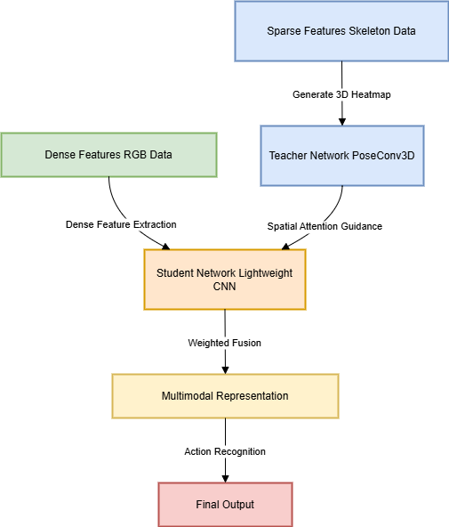

# CRYCHIC (Cross-modal Representation Yielding Complementary Hierarchical Integration and Consistency): 一種面向稀疏與稠密特徵對齊的多模態表示框架

<!-- **題目範例**：

提出一種專注於稀疏特徵（如骨架點、關鍵點或事件流）與稠密特徵（如 RGB 圖像）對齊的多模態表示框架，探索高效的跨模態映射技術，提升兩種特徵的互補性與信息表達能力。 -->

## **動機**：

稀疏特徵在處理遮擋與視角變化方面具有顯著優勢，而稠密特徵則能提供豐富的上下文資訊。在行為識別或場景理解任務中，稀疏與稠密特徵的互補性尤為突出。例如，在「打籃球」的場景中，骨架可以很好地描述運動員的投籃動作，而 RGB 則可以提供關於籃球位置、球場環境等信息。這兩種類型的特徵在表達空間和尺度上存在顯著差異，如何高效對齊它們以實現信息互補，對於多模態應用（如行為識別和場景理解）具有重要意義。

## **研究挑戰**：

1. **跨模態特徵對齊**：

   - 稀疏特徵與稠密特徵的表示空間差異顯著，如何設計統一的特徵對齊機制是主要挑戰。
   - 可探索基於圖卷積網絡（Graph Convolution Network, GCN）或對比學習（Contrastive Learning）的跨模態映射方法。
   - GCN 的優點是可以捕捉骨架的結構信息，但計算量較大；對比學習則能學習到更魯棒的特徵表示，但需要大量的訓練數據。
2. **多尺度對齊**：

   - 稀疏與稠密特徵的尺度差異使得對齊過程需要兼顧全局與局部信息，需設計多尺度對齊策略。
3. **模態間信息互補**：

   - 如何利用 RGB 信息彌補骨架信息在細微動作上的不足，或者利用骨架信息幫助 RGB 定位關鍵區域。
4. **信息損失最小化**：

   - 在對齊過程中，避免稀疏特徵的幾何信息或稠密特徵的上下文信息丟失，需設計信息保持的優化目標。

## **創新點**

1\. 教師網絡的空間注意力傳遞

- 通過教師網絡提取骨架的空間動態信息，為學生網絡提供高效的空間引導，解決稀疏與稠密特徵對齊的挑戰。

2\. 跨模態對比學習（Cross-Modality Contrastive Learning）

- 在融合過程中，設計對比損失函數，強化稀疏與稠密特徵的表示一致性，同時保持兩者的差異性。

3\. 多尺度時空動態建模

- 將多尺度時空卷積應用於骨架與稠密特徵處理中，提升模型對細粒度動作與長時間行為的識別能力。例如，採用不同尺度的卷積核來處理骨架與 RGB 特徵，結合全局與局部動態信息。

## **實驗設計**

1. **數據集**：

   - 使用多模態數據集（如 COCO、NTU RGB+D）進行特徵對齊的定量分析與可視化驗證。
2. **對比方法**：

   - 與現有骨架模態（如 MS-G3D）、稠密模態（如 I3D）、以及多模態融合方法（如 STA-LSTM）進行比較。
3. **評估指標**：

   - 模型準確率（Accuracy）。
   - 跨模態表示的一致性（Alignment Consistency），例如使用 cosine similarity 計算特徵向量之間的相似度。
   - 推理效率（Inference Efficiency）。
4. **消融實驗（Ablation Study）**：

   - 驗證每個創新點（如多尺度建模、跨模態對比學習）對最終性能的貢獻。

## **主要架構設計**

1. **主體框架：骨架特徵為核心，稠密特徵為補充**

- **骨架特徵處理（Skeleton Feature Processing）**：

  - 基於 PoseConv3D 模型的設計，將骨架特徵轉換為高質量的 3D heatmap volume，並輸入到改良的 3D-CNN 模型中進行特徵提取。
  - 引入基於多尺度設計的卷積模塊，捕捉局部與全局的空間-時間動態。
- **稠密特徵處理（Dense Feature Processing）**：

  - 利用 RGB 帧生成對應的時空特徵，設計一個輕量化 CNN 作為學生網絡，聚焦於捕捉對骨架特徵有補充作用的外觀資訊（如手持物體、環境背景）。

2. **跨模態融合：引入 Teacher-Student 機制**

- **教師網絡（Teacher Network）**：

  - 使用 PoseConv3D 作為骨架特徵教師網絡，為學生網絡提供稀疏模態的高層次空間注意力權重。
  - 基於教師網絡的輸出，引導學生網絡關注 RGB 中與骨架關節相關的區域（例如手部、頭部和腳部的局部信息）。
- **學生網絡（Student Network）**：

  - 基於輕量 CNN 或 ResNet18 的學生網絡，使用來自教師網絡的空間權重生成加權的稠密模態特徵。
  - 融合這些稠密特徵與教師網絡的輸出，生成最終的跨模態表示。

3. **多階段訓練策略**

- **階段 1：教師網絡預訓練**：

  - 在骨架數據（如 NTU RGB+D）上訓練教師網絡，獲得穩定的骨架特徵表示。
- **階段 2：學生網絡學習**：

  - 固定教師網絡權重，通過學生網絡在稠密數據（如 RGB）上學習骨架引導的加權特徵。
- **階段 3：跨模態聯合微調**：

  - 聯合優化教師與學生網絡的權重，最大化跨模態的融合效果。
  - 例如，通過教師網絡輸出的空間權重，增強學生網絡對關鍵區域的關注，同時保持全局特徵的完整性。
